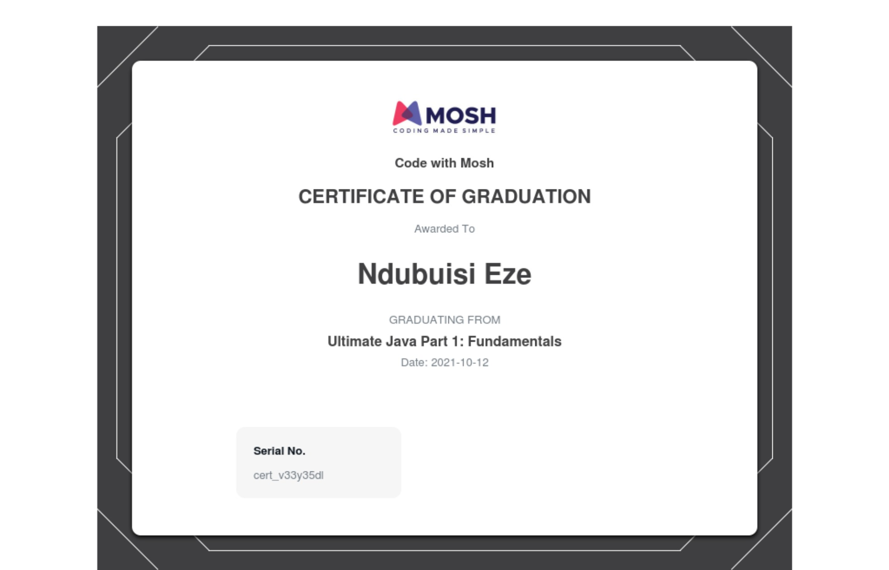
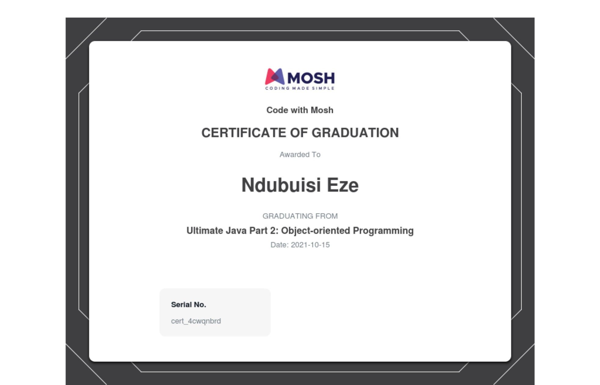

### Hey 👋🏽, I'm [Ndubuisi James Eze](https://ndblaze.github.io/portfolio/) ✨ ⚡

**Glad to see you here!** :star_struck: ⚡ a Web Developer and Open Source Developer🚀 from Nigeria.    

<!--   -->

Here are some ideas to get you started:

- 📫 How to reach me: ... [Gmail] (ndubuisieze60@gmail.com)

Certification

<!--
**Ndblaze/Ndblaze** is a ✨ _special_ ✨ repository because its `README.md` (this file) appears on your GitHub profile.

Here are some ideas to get you started:

- 🔭 I’m currently working on ...
- 🌱 I’m currently learning ...
- 👯 I’m looking to collaborate on ...
- 🤔 I’m looking for help with ...
- 💬 Ask me about ...
- 📫 How to reach me: ...
- 😄 Pronouns: ...
- ⚡ Fun fact: ...
  -->
